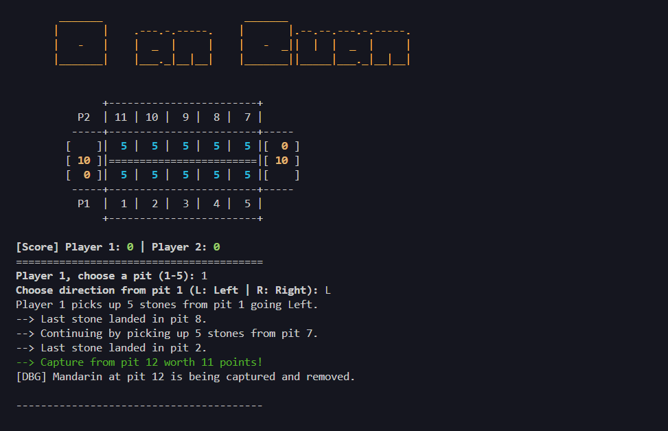

<h1 align="center"> Ô Ăn Quan 👨‍🌾👨‍⚖️ </h1>

## 🎮 Rules of the Game

Ô Ăn Quan is a strategic sowing-and-capturing game played on a board with 12 pits:

- 10 small pits (called `dân`, or “`people`”) divided evenly between the two players.
- 2 big pits (called `quan`, or “`mandarins`”) located at each end of the board.

Each small pit starts with `5 stones`, and each quan starts with `10 stones`.

---

## 📜 Gameplay

1. Starting a Turn - The player picks up all stones from one of their 5 small pits and sows them `clockwise` or `counterclockwise`.

2. Continuation Rule - If the last stone lands in a pit with stones, pick them up and keep `sowing`.

3. Capture Rule - If the next pit is empty and the following pit has stones, `capture` them.

4. Rich Pit Strategy - Players can stockpile stones in one pit and capture them later.

5. Turn Ends - If the `next two pits` are empty, or if the next pit is a quan.

6. Borrowing Stones - If all 5 pits on a player’s side are empty, they must pay 5 stones (from their captured pile) to refill.

7. End of the Game - The game ends when `all stones are captured`. Remaining stones in a player’s row belong to that player.

---

## ⚙️ How to Build & Run

This project is written in `C++` and designed for the `terminal`.
It uses ASCII art for the board and ANSI escape codes for colors and effects.

## 🔧 Build Instructions

```c++
# Clone the repository
git clone https://github.com/Hantaro171902/o-an-quan.git
cd o-an-quan
mkdir build && cd build
cmake ..
make 
# Run the game
./O-an-quan

```

On Windows:
```c++
g++ -std=c++17 -O2 -o oanquan.exe main.cpp
.\oanquan.exe
```
---

## ✅ Requirements

C++17 or later

Terminal with ANSI color support (Linux, macOS, or Windows Terminal)

## 📸 Preview



## ✨ Features

- Vietnamese traditional game logic
- `ASCII` art rendering of the board
- ANSI color codes for highlights and captures
- Turn-based two-player mode in the terminal

# 📌 Fuuture update

- Add AI opponent for single-player mode
- Implement save/load game feature
- Add sound effects (beeps for captures, etc.)
- Improve ASCII board design with animations
- Add configurable rules (e.g., allow/disallow quan non capture)
- Online multiplayer mode (via sockets or simple server)
- Packaging & cross-platform build scripts

# 🤝 Contributing

Contributions are welcome! Here’s how you can help:

1. Fork the repository
2. Create a new branch for your feature/fix:

```
git checkout -b feature/awesome-feature
```

3. Commit your changes:
```
git commit -m "Add awesome feature"
```

4. Push to your branch:
```
git push origin feature/awesome-feature
```

5. Open a Pull Request 🎉

# 📜 License

This project is licensed under the MIT License - you are free to use, modify, and share it with attribution.

---

# 💖 Support

If you enjoy this project and want to support its development:

- ⭐ Star this repo to show your love
- ☕ Buy me a coffee
- 💌 Share the project with friends who love Vietnamese games
- 🐦 Follow me on LinkedIn

Your support keeps me motivated to build more fun `C++ terminal games with ASCII art` 🚀

